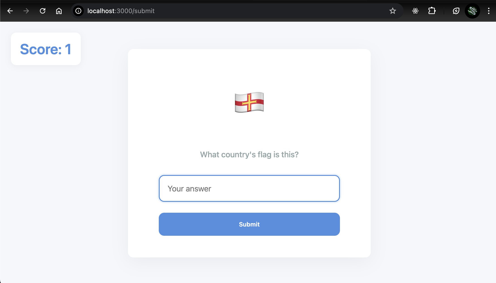

# 🌍 Flags Quiz Web App

A fun and educational web application that challenges users to identify countries based on their flags. This app uses a PostgreSQL database, Express.js, EJS templating, and CSV file integration for importing country data.

---

## 🚀 Features

- Displays random flags and asks users to identify the corresponding country
- Tracks score and resets on incorrect answers
- Dynamically loads and manages questions from a PostgreSQL database
- Simple and intuitive UI with loading animation
- Automatic CSV-to-database population at startup

---

## 🛠️ Technologies Used

- **Node.js** with **Express.js** – server-side logic and routing
- **PostgreSQL** – database for storing flag and country data
- **EJS** – templating engine to render dynamic content
- **CSV Parser** – to read and import data from `flags.csv`
- **dotenv** – for managing environment variables
- **body-parser** – for handling form submissions

---

## 🧠 Skills Demonstrated

- Connecting and querying a **PostgreSQL** database using the `pg` package
- Server-side rendering with **EJS**
- Parsing and importing data from a **CSV** file into a relational database
- Implementing game logic (score tracking, question pool handling)
- Handling POST requests and user inputs with **Express** middleware
- Using environment variables securely with `dotenv`

---
## ⚙️ How to Run This Project

1. **Clone the repository**
```bash
    git clone https://github.com/your-username/flags-quiz.git
    cd flags-quiz
```

2. **Install dependencies**
```bash
    npm install
```

3. **Create .env file**
    PG_USER=your_pg_username
    PG_HOST=localhost
    PG_DATABASE=your_database_name
    PG_PASSWORD=your_password
    PG_PORT=5432

4. **Create the flags table in PostgreSQL**
``` sql
    CREATE TABLE flags (
        id INT PRIMARY KEY,
        name TEXT,
        flag TEXT
    );

```

5. **Start the server**
``` bash
    node app.js
```

6. **Visit the app**
    Open your browser and go to:
    http://localhost:3000

## 📷 Screenshot
    

## 👨‍💻 Author
    Pawan Sanklapa
    Full Stack Developer in Training
    Email: pawansankalpanew123@example.com
    GitHub: @PawanSankalpa


-----------------------------------------------------------------------------------


## 🧠 Application Logic – Flag Quiz

### 🎯 Data Handling

- `totalScore` starts at **0**.
- An empty array called `availableQuestions` holds the remaining questions for the current session.

---

### 🔄 Function: `loadQuestions()`

- Fetches all flags from the database.
- Stores them in the `availableQuestions` array.
- This function is also used to **refresh** the questions when the user runs out.

---

### 🎲 Function: `getRandomQuestion()`

- Picks a **random question** from `availableQuestions`.
- Removes the selected question from the array to avoid repetition.
- If all questions are used, it:
  - Calls `loadQuestions()` to reload them.
  - Resets `totalScore` to 0.

---

### 📥 Route: GET `/`

- When the user opens the homepage:
  - A random flag is picked using `getRandomQuestion()`.
  - The `index.ejs` template is rendered with:
    - `flag`: the flag emoji or image
    - `name`: country name (used internally)
    - `id`: flag ID
    - `score`: user's current score

---

### ✅ Route: POST `/submit`

- Triggered when the user submits their answer.
- Retrieves:
  - `answerInput`: what the user typed
  - `answerId`: the ID of the flag shown

- Checks the correct answer from the database using the ID.
- Compares the user's answer with the correct one:
  - **If correct**: increase `totalScore` by 1.
  - **If wrong**: reset `totalScore` to 0 and reload all questions.

- Then a **new random flag** is selected and sent to the frontend with the updated score.

---

💡 _Note: I used ChatGPT to help organize this summary. It’s clearer and easier to read than my initial version!_

